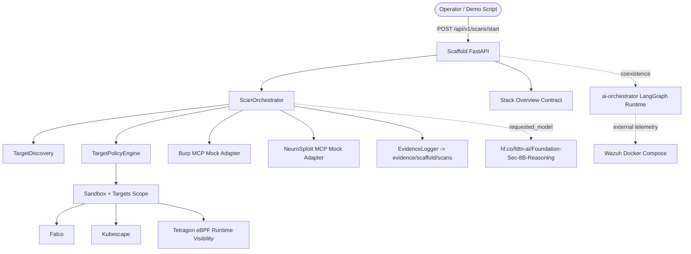

# laboratorio-controlado-de-ciberseguridad-cloud-native-con-IA

## Estado actual del repositorio

Este repo ahora muestra un **escenario unificado** donde conviven de forma EXPLÍCITA:

- `ai_apps/` como **API/base moderna** de entrada.
- `ai-orchestrator/` como **runtime experimental/legacy avanzado**.
- `k8s_platform/` como **layout Kubernetes moderno** para sandbox y targets.
- `infrastructure/` como **capa de bootstrap, hardening y soporte legacy**.
- **Falco + Kubescape + Tetragon + Wazuh** como sensores/capas de seguridad con responsabilidades distintas.

Importante: sigue siendo un laboratorio controlado. Acá se deja claro qué es **real**, qué es **scaffold**, qué es **mock** y qué es **experimental/legacy**. NO se vende humo con integraciones productivas que todavía no existen.

## Documentación principal

- Ver `propuesta-escenario-argos.md` para la propuesta completa del laboratorio.
- Ver `docs/architecture/decision_tecnica.md` para la revisión de decisiones de arquitectura.
- Ver `WALKTHROUGH.md` para la guía detallada de hardening, despliegue y convivencia entre capas.

## Escenario unificado: moderno + legacy

- `ai_apps/api/`: FastAPI scaffold con `GET /health`, `GET /api/v1/stack-overview` y `POST /api/v1/scans/start`.
- `ai_apps/agents/`: orquestación base, discovery mínimo y validación de requests.
- `ai_apps/agents/legacy_bridge.py`: bridge in-process hacia `ai-orchestrator` cuando se solicita `legacy_bridge`.
- `ai_apps/mcp_clients/`: adapters mock explícitos para Burp y NeuroSploit.
- `ai_apps/guardrails/`: policy engine estructurado y evidence logger JSON.
- `ai_apps/contracts/unified-stack-profile.json`: contrato documental/técnico del stack unificado.
- `k8s_platform/sandbox/`: manifiestos modernos para `mcp-server`, `burp-suite` y `neurosploit`.
- `k8s_platform/targets/`: manifiestos modernos para `juiceshop` y `dvwa`.
- `ai-orchestrator/`: runtime previo/experimental con LangGraph, preservado como capa avanzada/legacy.
- `infrastructure/k8s/`: bootstrap con Kind, apps legacy, network policies y values/configs de sensores.
- `infrastructure/k8s/security/tetragon-runtime-observability.yaml`: contrato base para Tetragon como sensor eBPF/runtime.
- `evidence/scaffold/scans/`: evidencia persistida por el scaffold API.

## Modelo LLM referenciado

El stack unificado referencia explícitamente el modelo:

`hf.co/fdtn-ai/Foundation-Sec-8B-Reasoning`

Importante: en esta etapa el modelo queda **declarado e integrado en contratos y configuración**, pero el repo NO intenta fingir todavía serving integral de producción, correlación completa de sensores ni automatización cerrada de respuesta.

## Arquitectura unificada del laboratorio



## Cómo conviven las capas sin contradecirse

### 1. `ai_apps/` = entrada moderna y segura

Es la capa recomendada para demos, contratos API, guardrails y persistencia de evidencia estructurada.

### 2. `ai-orchestrator/` = runtime legacy/experimental avanzado

No reemplaza al scaffold: lo complementa. Se conserva como referencia y runtime más profundo para casos donde se quiera evolucionar hacia multiagente/LangGraph, HIL y automatización más sofisticada.

### 3. `k8s_platform/` = layout moderno del escenario

Representa el layout Kubernetes nuevo del laboratorio:

- `sandbox`: herramientas/control plane mock del scaffold.
- `targets`: objetivos modernos del laboratorio.

### 4. `infrastructure/` = bootstrap + soporte + legado útil

Mantiene lo que el layout moderno NO debe duplicar:

- creación del clúster Kind
- apps legacy vulnerables
- values/config de Falco, Kubescape y Tetragon
- network policies compartidas
- Wazuh fuera del clúster vía Docker Compose

## Sensores del escenario

- **Falco**: detección runtime clásica en Kubernetes.
- **Kubescape**: postura/configuración + correlación de seguridad.
- **Tetragon**: **sensor eBPF de runtime y visibilidad de procesos**. Queda integrado como base de observabilidad/runtime, NO como respuesta productiva mágica ya terminada.
- **Wazuh**: capa externa tipo SIEM/XDR para agregación y análisis complementario.

## Qué es real, mock y experimental

### Real en este scaffold/base

- API FastAPI funcional.
- Validación de payload con Pydantic.
- Guardrails de alcance con validación de namespaces, DNS e IPs de laboratorio.
- Persistencia real de evidencia JSON dentro del repo.
- Contrato JSON del stack unificado.
- Manifiestos Kubernetes modernos y legacy coexistiendo con responsabilidades claras.
- Base config de Tetragon + camino de despliegue por Helm.

### Intencionalmente mock o no cerrado todavía

- Integración MCP real con Burp Suite.
- Integración MCP real con NeuroSploit.
- Pipeline productivo completo de Tetragon/Falco/Kubescape/Wazuh hacia respuesta automática.
- Planeación multiagente de producción completamente estabilizada.
- Serving completo del modelo LLM en runtime.

## Cómo ejecutar el scaffold API

### 1. Instalar dependencias

```bash
python -m venv .venv
# source .venv/bin/activate
# .\.venv\Scripts\Activate
pip install -r ai_apps/requirements.txt
```

### 2. Levantar la API

```bash
uvicorn ai_apps.api.main:app --reload
```

### 3. Probar health

```bash
curl http://localhost:8000/health
```

### 4. Inspeccionar el stack unificado

```bash
curl http://localhost:8000/api/v1/stack-overview
```

### 5. Lanzar un scan base

```bash
curl -X POST http://localhost:8000/api/v1/scans/start \
  -H "Content-Type: application/json" \
  -d '{
    "scan_name": "baseline-lab-scan",
    "target": "juiceshop.targets.svc.cluster.local",
    "target_namespace": "targets",
    "allowed_tools": ["burp", "neurosploit"],
    "require_approval": true,
    "requestor": "readme-example"
  }'
```

### 6. Elegir modo de ejecución: `scaffold` o `legacy_bridge`

El request ahora puede elegir el camino de ejecución de forma EXPLÍCITA:

- `scaffold` → default sensato; usa los mock adapters propios de `ai_apps/`.
- `legacy_bridge` → delega **in-process** a `ai-orchestrator/app/agents/supervisor.py:run_supervisor_workflow`.

Ejemplo default (`scaffold` por omisión):

```bash
curl -X POST http://localhost:8000/api/v1/scans/start \
  -H "Content-Type: application/json" \
  -d '{
    "scan_name": "baseline-lab-scan",
    "target": "juiceshop.targets.svc.cluster.local",
    "target_namespace": "targets",
    "allowed_tools": ["burp", "neurosploit"],
    "requestor": "readme-scaffold"
  }'
```

Ejemplo puenteando al runtime legacy:

```bash
curl -X POST http://localhost:8000/api/v1/scans/start \
  -H "Content-Type: application/json" \
  -d '{
    "scan_name": "legacy-bridge-scan",
    "target": "juiceshop.targets.svc.cluster.local",
    "target_namespace": "targets",
    "allowed_tools": ["burp", "neurosploit"],
    "execution_mode": "legacy_bridge",
    "require_approval": false,
    "requestor": "readme-legacy-bridge"
  }'
```

También podés usar perfil en vez de modo:

```json
{
  "execution_profile": "legacy"
}
```

La respuesta/evidencia ahora deja explícito:

- `execution_mode`
- `execution_details.bridge_path`
- `finding_sources`
- `limitations`

Eso evita vender humo: si corrés `legacy_bridge`, los findings quedan marcados como originados en `ai-orchestrator` y se explicita que ese runtime sigue siendo experimental/mockeado en partes.

## Despliegue del laboratorio unificado

`deploy-lab.ps1` ahora contempla el escenario híbrido:

1. crea/usa el clúster Kind
2. despliega ingress
3. aplica `k8s_platform/sandbox/`
4. aplica `k8s_platform/targets/`
5. mantiene `infrastructure/k8s/apps/vulnerable-apps.yaml`
6. aplica `infrastructure/k8s/security/network-policies.yaml`
7. aplica base config de **Tetragon**
8. si existe Helm, instala **Kubescape + Falco + Tetragon**

## Demo script endurecido

`demo-scenario.ps1` ya NO hardcodea la API key. Ahora la toma desde:

1. parámetro `-ApiKey`, o
2. variable de entorno `ARGOS_API_KEY`

Ejemplo:

```powershell
$env:ARGOS_API_KEY = "tu-api-key"
./demo-scenario.ps1
```

También podés cambiar el endpoint con `-ApiUrl` o `ARGOS_API_URL`.

## Estructura histórica del repo

Además del stack unificado, el repo conserva componentes previos útiles como referencia y expansión:

- `infrastructure/`: bootstrap, seguridad runtime, Wazuh y políticas compartidas.
- `ai-orchestrator/`: implementación anterior/experimental con LangGraph.
- `ai-security-testing/`: evaluación de seguridad para prompts/agentes.
- `offensive/`: activos de CALDERA y emulación.

## Nota de seguridad

Se endureció `.gitignore` para reducir riesgo de trackear material criptográfico generado (`*.key`, `*.pem`, `*.crt`, etc.). OJO: eso no destrackea secretos ya versionados; esos archivos deben sanearse aparte si se decide limpiarlos del historial.

## Bootstrap seguro de Wazuh y CALDERA

### Wazuh

1. Copiá `infrastructure/wazuh/.env.example` a `infrastructure/wazuh/.env`.
2. Completá `INDEXER_PASSWORD`, `API_PASSWORD` y `DASHBOARD_PASSWORD` con secretos fuertes.
3. Si tu topología local cambia, ajustá `infrastructure/wazuh/config/certs.yml` ANTES de regenerar certificados.
4. Regenerá el material TLS localmente:

```powershell
docker compose -f infrastructure/wazuh/generate-certs.yml run --rm generator
```

5. Copiá `infrastructure/wazuh/config/wazuh_dashboard/wazuh.local.yml.example` a `infrastructure/wazuh/config/wazuh_dashboard/wazuh.local.yml`.
6. Reemplazá `__SET_WAZUH_API_PASSWORD__` por el mismo valor que uses en `API_PASSWORD`.
7. Si necesitás exponer más que localhost, cambiá los `*_BIND_IP` en `infrastructure/wazuh/.env` de forma EXPLÍCITA.
8. Recién ahí levantá el stack Wazuh con `docker compose -f infrastructure/wazuh/docker-compose.yml up -d`.

Hardening aplicado:

- ya NO quedan defaults sensibles funcionales en archivos trackeados críticos
- `9200`, `55000` y `8444` quedan atados a loopback por default
- el dashboard monta `wazuh.local.yml` en vez de un archivo trackeado con secreto duro
- si faltan secretos, Docker Compose falla temprano en vez de arrancar con credenciales débiles
- los PEM/KEY del indexer/manager/dashboard dejan de versionarse y pasan a ser artefactos locales regenerables

Rotación recomendada de Wazuh:

1. `docker compose -f infrastructure/wazuh/docker-compose.yml down`
2. eliminar localmente los PEM/KEY existentes dentro de `infrastructure/wazuh/config/wazuh_indexer_ssl_certs/`
3. regenerar con `generate-certs.yml`
4. volver a levantar el stack
5. si buscás un bootstrap realmente limpio de CA/estado, recrear manualmente los volúmenes de Wazuh antes de levantar otra vez

### CALDERA

1. Revisá `offensive/caldera/.env.example` y, si necesitás cambiar exposición local, copiá los valores a un `.env` local en esa carpeta.
2. Levantá CALDERA con su compose. El primer arranque normal genera `offensive/caldera/caldera-src/conf/local.yml` con secretos aleatorios dentro del volumen persistente `caldera_conf`.
3. Guardá las credenciales/API keys que CALDERA muestra en logs al crear `local.yml`.
4. NO uses `--insecure` salvo para debugging aislado y efímero.
5. Si activás certificados HTTPS propios para CALDERA, mantenelos como material LOCAL/NO versionado dentro de `conf/local.yml` o en un volumen, nunca en el repo.
6. Si ya venías usando CALDERA con un volumen previo, regenerá `caldera_conf` manualmente si querés descartar secretos viejos.

Hardening aplicado:

- `conf/default.yml` quedó como plantilla saneada, sin secretos reales
- la estrategia recomendada pasa por `conf/local.yml` autogenerado y persistido en volumen
- UI/HTTPS/SSH/FTP quedan en loopback por default; los canales de agentes siguen configurables para el laboratorio
- se corrigió la publicación UDP de `7011`, que antes estaba ambigua/incorrecta

## Limitaciones honestas

- Este cambio NO limpia el historial git previo ni rota secretos ya expuestos fuera del repo.
- La rotación real sigue siendo una tarea OPERATIVA manual: hay que regenerar localmente los certs de Wazuh y, si corresponde, recrear volúmenes/estado persistente antes de confiar en el entorno renovado.
- Algunos canales opcionales de CALDERA (FTP/SSH tunnel) quedan con placeholders en `default.yml`; si se usan, el operador debe completarlos en `conf/local.yml`.
- Si existe un volumen `caldera_conf` previo al saneamiento, puede seguir conteniendo secretos históricos hasta que el operador lo regenere.
