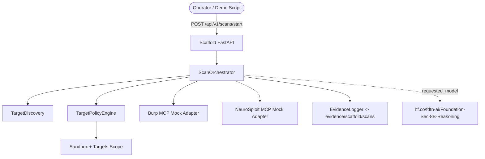

# laboratorio-controlado-de-ciberseguridad-cloud-native-con-IA

## Estado actual del repositorio

Este repositorio ahora incluye una **arquitectura base funcional** para el laboratorio, pensada como scaffold de integración y NO como plataforma productiva completa. La idea es dejar bien armados los contratos entre API, agentes, guardrails, clientes MCP mock y manifiestos Kubernetes base, sin fingir que ya existe toda la implementación real.

## Documentación principal

- Ver `propuesta-escenario-argos.md` para la propuesta completa del laboratorio.
- Ver `docs/architecture/decision_tecnica.md` para la revisión de decisiones de arquitectura.
- Ver `WALKTHROUGH.md` para la guía detallada de hardening y operación.

## Nuevo scaffold base

- `ai_apps/api/`: FastAPI scaffold con `GET /health` y `POST /api/v1/scans/start`.
- `ai_apps/agents/`: orquestación base, discovery mínimo y validación de requests.
- `ai_apps/mcp_clients/`: adapters mock explícitos para Burp y NeuroSploit.
- `ai_apps/guardrails/`: policy engine estructurado y evidence logger JSON.
- `k8s_platform/sandbox/`: manifiestos base para `mcp-server`, `burp-suite` y `neurosploit`.
- `k8s_platform/targets/`: manifiestos base para `juiceshop` y `dvwa`.
- `evidence/scaffold/scans/`: evidencia persistida por el scaffold API.

## Modelo LLM referenciado

El scaffold referencia explícitamente el modelo:

`hf.co/fdtn-ai/Foundation-Sec-8B-Reasoning`

Importante: en esta etapa el modelo queda **declarado e integrado en contratos y configuración**, pero el scaffold no intenta resolver todavía toda la ejecución real de razonamiento, serving, observabilidad ni seguridad operacional de producción.

## Arquitectura base del scaffold



## Qué es real y qué es mock

### Real en este scaffold

- API FastAPI funcional.
- Validación de payload con Pydantic.
- Guardrails de alcance con validación de namespaces, DNS e IPs de laboratorio.
- Persistencia real de evidencia JSON dentro del repo.
- Manifiestos Kubernetes base organizados por sandbox/targets.

### Intencionalmente mock en esta etapa

- Integración MCP real con Burp Suite.
- Integración MCP real con NeuroSploit.
- Planeación multiagente de producción.
- Ejecución ofensiva real o automatización de explotación.
- Serving completo del modelo LLM en runtime.

## Cómo ejecutar el scaffold API

### 1. Instalar dependencias

```bash
python -m venv .venv
# source .venv/bin/activate
# .\.venv\Scripts\Activate
pip install -r ai_apps/requirements.txt
```

### 2. Levantar la API

```bash
uvicorn ai_apps.api.main:app --reload
```

### 3. Probar health

```bash
curl http://localhost:8000/health
```

### 4. Lanzar un scan base

```bash
curl -X POST http://localhost:8000/api/v1/scans/start \
  -H "Content-Type: application/json" \
  -d '{
    "scan_name": "baseline-lab-scan",
    "target": "juiceshop.targets.svc.cluster.local",
    "target_namespace": "targets",
    "allowed_tools": ["burp", "neurosploit"],
    "require_approval": true,
    "requestor": "readme-example"
  }'
```

## Demo script endurecido

`demo-scenario.ps1` ya NO hardcodea la API key. Ahora la toma desde:

1. parámetro `-ApiKey`, o
2. variable de entorno `ARGOS_API_KEY`

Ejemplo:

```powershell
$env:ARGOS_API_KEY = "tu-api-key"
./demo-scenario.ps1
```

También podés cambiar el endpoint con `-ApiUrl` o `ARGOS_API_URL`.

## Estructura histórica del repo

Además del scaffold nuevo, el repo conserva componentes previos que siguen siendo útiles como referencia:

- `infrastructure/`: manifiestos Kubernetes, Wazuh y políticas previas.
- `ai-orchestrator/`: implementación anterior/experimental con LangGraph.
- `ai-security-testing/`: evaluación de seguridad para prompts/agentes.
- `offensive/`: activos de CALDERA y emulación.

## Nota de seguridad

Se endureció `.gitignore` para reducir riesgo de trackear material criptográfico generado (`*.key`, `*.pem`, `*.crt`, etc.). OJO: eso no destrackea secretos ya versionados; esos archivos deben sanearse aparte si se decide limpiarlos del historial.
