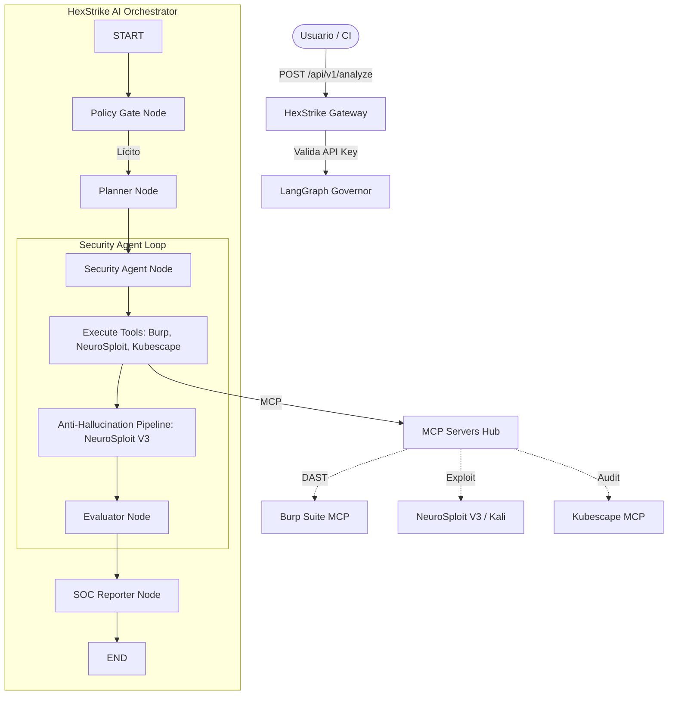

# laboratorio-controlado-de-ciberseguridad-cloud-native-con-IA

## Documento de propuesta

- Ver `propuesta-escenario-argos.md` para la propuesta completa del laboratorio.
- Ver `docs/architecture/decision_tecnica.md` para la revisión de decisiones de arquitectura.
- **Ver [WALKTHROUGH.md](WALKTHROUGH.md) para la guía detallada de hardening y operación.**

## Estructura base del proyecto

- `infrastructure/`: manifiestos Kubernetes (K8s), configuración de Wazuh y políticas.
- `ai-orchestrator/`: API FastAPI principal, **HexStrike AI Orchestrator** con LangGraph.
- `ai-security-testing/`: Entorno de evaluación (promptfoo) de inyecciones y out-of-scope.
- `offensive/`: Configuración y despliegue de plataformas de emulación (CALDERA).
- `evidence/`: almacenamiento de evidencias auditables.
- `scripts/`: utilidades de despliegue y ejecución local.

## Arquitectura HexStrike AI



## Ejecución rápida de la API

```bash
cd ai-orchestrator
python -m venv .venv
# source .venv/bin/activate (Linux/Mac)
# .\.venv\Scripts\Activate (Windows)
pip install -r requirements.txt
cd ..
./scripts/run_api.sh
```
