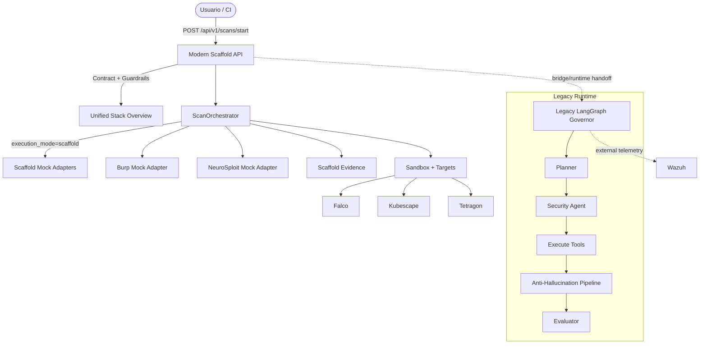

# WALKTHROUGH: Implementación, Integración y Hardening de HexStrike AI (ARGOS)

Este documento describe el escenario unificado del laboratorio ARGOS: **scaffold moderno + runtime legacy/experimental + sensores de seguridad + capas Kubernetes diferenciadas**.

---

## 🚀 Guía Rápida de Inicio

1. **Despliegue de Infraestructura**:
   ```powershell
   ./deploy-lab.ps1
   ```
2. **Arranque del Scaffold API**:
   ```bash
   uvicorn ai_apps.api.main:app --reload
   ```
3. **Inspección del Stack Unificado**:
   ```bash
   curl http://localhost:8000/api/v1/stack-overview
   ```
4. **Ejecución de Demo**:
   ```powershell
   ./demo-scenario.ps1
   ```

---

## 🛡️ Resumen de las fases del escenario unificado

### Fase 1: Arquitectura de API Segura
- `ai_apps/` queda como entrada moderna para el laboratorio.
- El scaffold expone contratos simples, guardrails y evidencia persistida.

### Fase 2: Gestión de Secretos (Infraestructura)
- Las credenciales sensibles de soporte siguen fuera del código duro.
- `infrastructure/` conserva la parte operativa que no debe mezclarse con el scaffold.

### Fase 3: Convivencia Moderna + Legacy
- `ai_apps/` queda como entrypoint moderno y contrato explícito del laboratorio.
- `ai-orchestrator/` se preserva como runtime experimental/legacy avanzado, no como capa descartada.
- `ai_apps` ahora puede delegar opcionalmente al runtime legacy con `execution_mode=legacy_bridge` usando un bridge **in-process**.
- `k8s_platform/` e `infrastructure/` quedan conectados con responsabilidades distintas.

### Fase 4: Guardrails de IA
- El scaffold sigue validando alcance, target y herramientas solicitadas.
- La idea es frenar requests fuera del laboratorio ANTES de cualquier ejecución más agresiva.

### Fase 5: Alineación de Modelos
- El stack mantiene como referencia `hf.co/fdtn-ai/Foundation-Sec-8B-Reasoning`.

### Fase 6: Persistencia de Evidencias
- `ai_apps/` guarda evidencia estructurada en `evidence/scaffold/scans/`.
- `ai-orchestrator/` conserva su propia carpeta histórica de evidencias en `evidence/analyses/`.
- Cuando se usa `legacy_bridge`, la evidencia del scaffold registra además el modo, origen de findings, bridge path y limitaciones del runtime legacy.

### Fase 7: Sensores de Runtime Unificados
- **Falco** como detección runtime.
- **Kubescape** como postura/configuración y correlación.
- **Tetragon** como visibilidad de procesos y runtime basada en **eBPF**.
- **Wazuh** como capa externa de agregación/telemetría.

### Fase 8: Sandbox y Targets Modernos
- `k8s_platform/sandbox/` concentra `mcp-server`, `burp-suite` y `neurosploit` como componentes scaffold/mock.
- `k8s_platform/targets/` concentra `juiceshop` y `dvwa` como targets modernos.

### Fase 9: Legacy útil y no contradictorio
- `infrastructure/k8s/apps/vulnerable-apps.yaml` sigue desplegando los objetivos legacy.
- `infrastructure/k8s/security/network-policies.yaml` ahora cubre `vulnerable-apps`, `sandbox` y `targets`.

### Fase 10: Contrato documental/técnico del stack
- `ai_apps/contracts/unified-stack-profile.json` documenta qué existe, qué es mock, qué es experimental y cómo conviven las capas.
- `GET /api/v1/stack-overview` expone ese contrato desde la API moderna.

---

## 📊 Arquitectura del Sistema



## 🧭 Qué despliega ahora `deploy-lab.ps1`

1. Kind + contexto de `kubectl`
2. Ingress NGINX
3. `k8s_platform/sandbox/*`
4. `k8s_platform/targets/*`
5. `infrastructure/k8s/apps/vulnerable-apps.yaml`
6. `infrastructure/k8s/security/network-policies.yaml`
7. `infrastructure/k8s/security/tetragon-runtime-observability.yaml`
8. Helm opcional para **Kubescape**, **Falco** y **Tetragon**

## 🔀 Modos de ejecución del endpoint `POST /api/v1/scans/start`

### Modo `scaffold` (default)

- usa `ai_apps/agents/orchestrator.py`
- corre discovery + policy + mock adapters propios
- deja findings marcados como `scaffold_mock_adapter`

Ejemplo:

```json
{
  "scan_name": "walkthrough-scaffold",
  "target": "juiceshop.targets.svc.cluster.local",
  "target_namespace": "targets",
  "allowed_tools": ["burp", "neurosploit"]
}
```

### Modo `legacy_bridge`

- mantiene los guardrails de `ai_apps`
- delega **in-process** a `ai-orchestrator/app/agents/supervisor.py:run_supervisor_workflow`
- NO llama por HTTP a `localhost` para fingir integración
- devuelve `finding_sources` y `limitations` para dejar claro qué vino del runtime legacy

Ejemplo:

```json
{
  "scan_name": "walkthrough-legacy-bridge",
  "target": "juiceshop.targets.svc.cluster.local",
  "target_namespace": "targets",
  "allowed_tools": ["burp", "neurosploit"],
  "execution_mode": "legacy_bridge",
  "require_approval": false,
  "requestor": "walkthrough"
}
```

También se acepta perfil:

```json
{
  "execution_profile": "legacy"
}
```

## ⚠️ Limitaciones honestas del bridge

- el runtime legacy sigue siendo experimental
- varias respuestas MCP del legacy siguen mockeadas
- el paso de aprobación humana legacy es simulado
- si faltan dependencias de `ai-orchestrator`, el endpoint responde error de disponibilidad en vez de fingir éxito

## 🔬 Qué significa Tetragon en ESTE repo

Tetragon queda integrado como:

- sensor de **runtime visibility**
- sensor **eBPF**
- visibilidad de **procesos/workloads** etiquetados para observación en namespaces del laboratorio

PERO no se presenta falsamente como una tubería productiva completa de respuesta automática, remediación cerrada y correlación perfecta. Acá queda el contrato correcto, el despliegue base y el punto de extensión.

## 🔐 Bootstrap seguro de Wazuh

1. Copiá `infrastructure/wazuh/.env.example` a `infrastructure/wazuh/.env`.
2. Definí secretos fuertes para:
   - `INDEXER_PASSWORD`
   - `API_PASSWORD`
   - `DASHBOARD_PASSWORD`
3. Copiá `infrastructure/wazuh/config/wazuh_dashboard/wazuh.local.yml.example` a `infrastructure/wazuh/config/wazuh_dashboard/wazuh.local.yml`.
4. Reemplazá `__SET_WAZUH_API_PASSWORD__` por el mismo valor que `API_PASSWORD`.
5. Recién ahí levantá el stack:

```powershell
docker compose -f infrastructure/wazuh/docker-compose.yml up -d
```

### Hardening aplicado en Wazuh

- `9200`, `55000` y `8444` publican en `127.0.0.1` por default.
- los puertos de ingesta (`1514`, `1515`, `514/udp`) siguen abiertos por default para no romper el laboratorio, pero ahora son configurables por `*_BIND_IP`
- Docker Compose exige secretos explícitos y ya NO cae en credenciales débiles por fallback
- `wazuh.yml` dejó de tener YAML duplicado/ambiguo y pasó a ser plantilla saneada

## 🔐 Bootstrap seguro de CALDERA

1. Opcionalmente copiá `offensive/caldera/.env.example` a `offensive/caldera/.env` si necesitás cambiar bind addresses.
2. Levantá CALDERA normalmente:

```powershell
docker compose -f offensive/caldera/docker-compose.yml up -d
```

3. En el primer arranque normal, CALDERA genera `conf/local.yml` con secretos aleatorios y los persiste en el volumen `caldera_conf`.
4. Guardá las credenciales/API keys mostradas en logs del primer bootstrap.
5. Evitá `--insecure`; si lo usás, `conf/default.yml` ya NO contiene secretos reales y requiere reemplazo manual de placeholders.
6. Si ya existía `caldera_conf`, eliminá/regenerá ese volumen para descartar secretos heredados.

### Hardening aplicado en CALDERA

- `default.yml` quedó saneado y pasa a ser base documental, no fuente de secretos reales
- `8889` y `8443` quedan en loopback por default
- `8022` y `2222` también quedan en loopback por default porque son canales opcionales de mayor riesgo local
- `7011` ahora se publica explícitamente como UDP
- se agrega `caldera_conf` para persistir `conf/local.yml` generado automáticamente

## ⚠️ Limitaciones y mitigaciones

- Esto NO rota secretos históricos ni limpia el historial git previo.
- Si los certificados de Wazuh ya fueron compartidos fuera del repo, hay que regenerarlos aparte.
- CALDERA sigue permitiendo modos inseguros upstream (`--insecure`); la mitigación en este repo es dejar esa vía SIN secretos reales preconfigurados y documentarla como excepción.
- Un volumen `caldera_conf` viejo puede seguir reteniendo credenciales previas hasta que el operador lo recree.

## 🧹 Limpieza del Entorno

Cuando termines tus pruebas, puedes desmantelar todo el escenario limpiamente:
```powershell
./cleanup-lab.ps1
```
