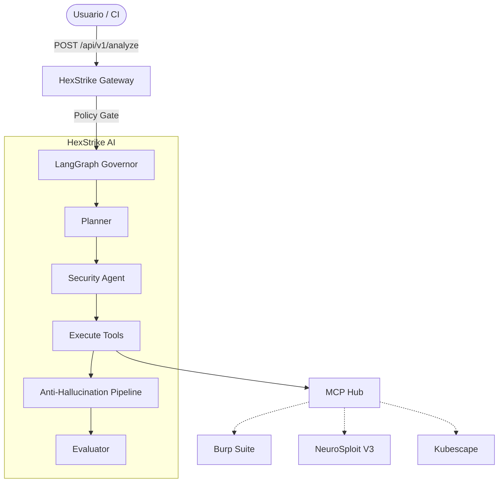

# WALKTHROUGH: Implementación y Hardening de HexStrike AI (ARGOS)

Este documento detalla las 10 fases de transformación aplicadas al laboratorio ARGOS para convertirlo en un entorno de ciberseguridad autónomo basado en **HexStrike AI**.

---

## 🚀 Guía Rápida de Inicio

1. **Despliegue de Infraestructura**:
   ```powershell
   ./deploy-lab.ps1
   ```
2. **Arranque del Orquestador**:
   ```bash
   ./scripts/run_api.sh
   ```
3. **Ejecución de Demo**:
   ```powershell
   ./demo-scenario.ps1
   ```

---

## 🛡️ Resumen de las 10 Fases de Hardening

### Fase 1: Arquitectura de API Segura
- Implementación de **FastAPI** con validación de `X-ARGOS-API-KEY`.
- Protección contra **Timing Attacks** usando `secrets.compare_digest`.
- Configuración de **CORS estricto** para evitar fugas de datos.

### Fase 2: Gestión de Secretos (Infraestructura)
- Extracción de todas las credenciales hardcodeadas en **Wazuh** y **OpenSearch** hacia un archivo `.env`.
- Actualización de `.gitignore` para proteger los archivos de entorno.

### Fase 3: Consolidación de Componentes
- Eliminación del backend obsoleto y unificación de la lógica en el directorio `ai-orchestrator`.
- Sincronización de scripts de arranque (`run_api.sh`).

### Fase 4: Guardrails de IA (Policy Gate)
- Creación de un **Policy Gate** en LangGraph que intercepta inyecciones de comandos y ataques fuera de alcance antes de que lleguen al modelo de lenguaje.

### Fase 5: Alineación de Modelos (HuggingFace)
- Configuración nativa para usar el modelo oficial `hf.co/fdtn-ai/Foundation-Sec-8B-Reasoning` a través de Ollama.

### Fase 6: Hardening de Herramientas Ofensivas
- Securización completa de **CALDERA C2**. Cambio de API Keys por defecto y contraseñas de acceso web/SSH por `ArgosSecure#2026!`.

### Fase 7: Gestión de Evidencias Auditables
- Implementación de persistencia automática. Cada análisis genera un JSON detallado en la carpeta `evidence/analyses/`.

### Fase 8: Identidad HexStrike & Herramientas de Élite
- Rebranding a **HexStrike AI Orchestrator**.
- Integración de **Burp Suite MCP** para análisis web DAST.
- Integración de **NeuroSploit V3** para emulación de adversarios.

### Fase 9: Alineación con el Diagrama de Arquitectura
- Incorporación de **DVWA** al Sandbox.
- Implementación de **Human-in-the-Loop (HIL)** para permitir la supervisión manual de las acciones de la IA.

### Fase 10: Detailed Working Example
- Sincronización del flujo completo para resolver tareas de mapeo web en **Juice Shop**, devolviendo respuestas estructuradas (Task/Subtask Answers) y evidencias técnicas.

---

## 📊 Arquitectura del Sistema



## 🧹 Limpieza del Entorno

Cuando termines tus pruebas, puedes desmantelar todo el escenario limpiamente:
```powershell
./cleanup-lab.ps1
```
